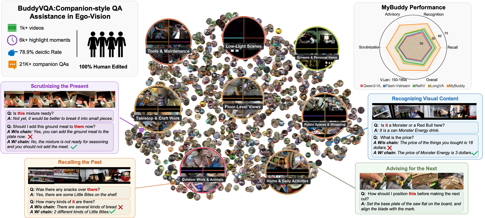
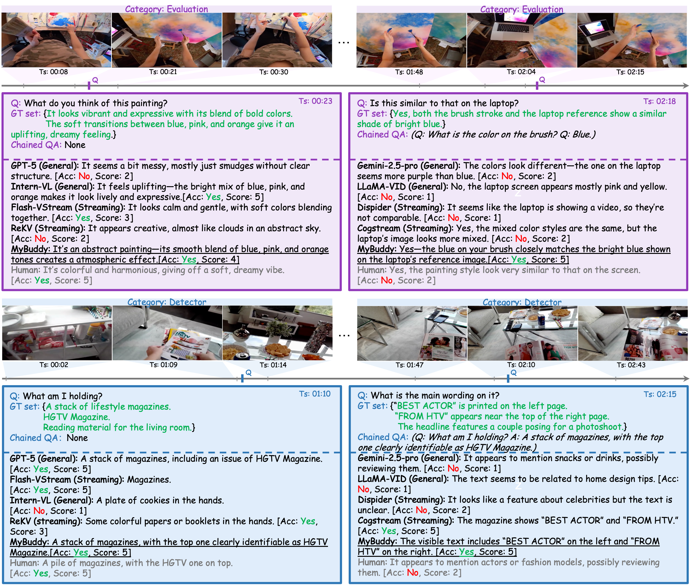
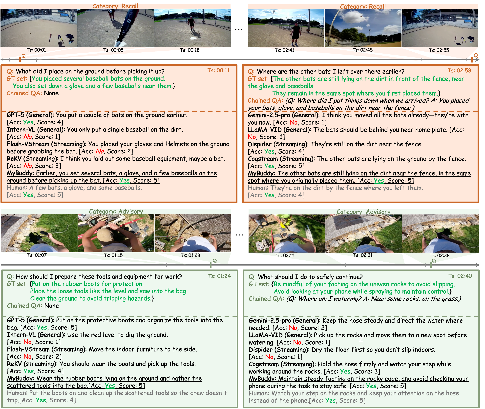

## BuddyVQA: Companion-Oriented QA Assistance in Egocentric Vision

----

### Introduction

----

AI companions are envisioned as always-on assistants that support users in daily life. We present BuddyVQA, a benchmark for companion-oriented question answering (QA) on egocentric streaming video. BuddyVQA contains 21.6K questions linked to 6K highlight moments across 1,012 long, egocentric videos. It features
two key characteristics that are common in daily first-person QA assistance but are largely overlooked in existing VideoQA datasets: ego-deictic expressions and interactively chained questions (e.g., “Where is it?”, “How to get there?”). These require models to infer a user’s in-situation intent by resolving visual pronouns in
the context of egocentric visual and history QA contents, with both grounded in long streaming setting. To tackle the challenges, we propose MyBuddy, a companion-oriented QA assistant that highlights a multimodal chain-of-thought reasoning mechanism to infer the final answer based on the historical QA and visual contents. Additional question router and multi-level memory are designed to facilitate efficient QA and visual information retrieval under streaming QA settings. Experiments show that MyBuddy achieves state-of-the-art performance on BuddyVQA and other VideoQA datasets, demonstrating its high effectiveness.

### BuddyVQA

----

To evaluate companion-centric QA on egocentric video streams, we construct a practical streaming QA dataset, BuddyVQA, built from videos that captures daily human activities, and enhanced using the multimodal reasoning capabilities of large vision–language models. 

### MyBuddy

----

After offline visual encoding, the Multi-Level Memory organizes features into three active levels. The Visual Information Retrieval module enhances visual understanding through captioning, filtering, and eye\&hand detection. The incoming question is classified by a Question Router. All visual and textual information and the question are processed by the zero-shot MLLM for online QA, while the Historical QA Buffer maintains prior QA pairs to support chained reasoning. 

### Visualizations

----

